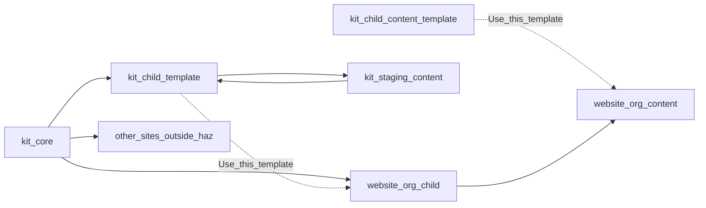

# HAZ.com vs kit staging

## Two jobs (do not collapse)

**HAZ.com uses the project.** That is required. The product site is a first-party *consumer*: it copies child + child-content, imports **core**, and lives in a **website org**. Same motion as any third party. If the public site never runs on HAZ modules, we are not dogfooding.

That does **not** mean HAZ.com replaces the kit live preview.

- **HAZ.com** pins released / agreed core (same as other sites). Real How Tos. Apex `https://hugoagentzero.com/`. Home/About can stay TODO.
- **Kit staging content** is the crash dummy for new module ideas *before* HAZ.com and third parties bump pins. Local `hugo server` is already “dev.” This remote repo is **staging**.

If we dump unreleased `haz_img` / graph experiments straight onto HAZ.com, we have no site that looks like a consumer and no place to break things on purpose. Keep both until staging is unused in practice; then delete it.

[#21](https://github.com/hugo-agent-zero/hugo-agent-zero/issues/21) writing shape unchanged: blog as FAQ / How To. [#13](https://github.com/hugo-agent-zero/hugo-agent-zero/issues/13) stays the kit ticket; the How To lives on HAZ.com.

## Rename (kit org)

`hugoagentzero_com-content` names the product site. It is not that.

Working slug: **`hugo-agent-zero-env-staging-content`**

- `env-dev` is the weaker name: anything local is already dev.
- `staging` matches the job: prove modules before other sites consume them.

GitHub rename + local folder rename. GitHub redirects the old repo URL; **Pages URL and Go module path do not**. Must update together:

- [`project-modules/hugoagentzero_com-content/go.mod`](project-modules/hugoagentzero_com-content/go.mod) `module` path
- [`project-modules/hugo-agent-zero-child/hugo.yaml`](project-modules/hugo-agent-zero-child/hugo.yaml) + [`go.mod`](project-modules/hugo-agent-zero-child/go.mod) import
- [`.github/workflows/pages.yml`](project-modules/hugoagentzero_com-content/.github/workflows/pages.yml) `hugo mod get` + `--baseURL` (will become `https://hugo-agent-zero.github.io/hugo-agent-zero-env-staging-content/`)
- HQ README (see below) and notes that still call this “HAZ.com”

Kit child stays pointed at **staging** content, not HAZ.com content.

## Public HQ README (no local layout)

[`hugo-agent-zero/README.md`](hugo-agent-zero/README.md) is for humans on GitHub. Briefly list **this org’s** repos and point at the other org. Do **not** document `project-modules/`, `project-website/`, or Windows paths.

Rewrite the current table (it still calls `hugoagentzero_com-content` “HAZ-owned content” and sends “docs for humans” to kit Pages). Shape:

- **This org (HAZ / kit):** HQ (Issues), core (shared module), child (build-root template), child-content (content template), env-staging-content (kit staging Pages — prove modules before other sites bump).
- **Other org (HAZ.com / website):** copies of child + child-content; consumes core. Not in this org because it is a *site*, not the kit — same as any other consumer. Docs for humans live there (HugoAgentZero.com once the domain is on). Staging Pages is not HAZ.com.

Local clone layout stays in org [`AGENTS.md`](AGENTS.md) and HQ notes only.

## `project-website/` folder

Do **not** create it yet. It is only useful once the website-org repos exist to clone into. An empty folder is noise. When those remotes are up, clone into `project-website/` (or create the folder as part of that clone).

## Website org: copy on GitHub, then clone (same as anyone else)

Do **not** `cp` templates on disk and invent remotes later.

1. Create the **HAZ-website** GitHub org.
2. In that org, **Use this template** (or generate from template) for:
   - kit `hugo-agent-zero-child`
   - kit `hugo-agent-zero-child-content`
   
   Today only **child-content** is marked a GitHub template. Mark **child** a template too, or use the equivalent “generate repo from this one” so the path matches third parties.
3. Clone those **website-org** repos into `project-website/`.
4. They import kit **core** (module pin). Local replacements = abs paths to `project-modules/hugo-agent-zero-core`. `baseURL` = apex.

Other HAZ sites stay **outside** `C:\_au\work\haz`.

## Local map

| Path | Role |
|------|------|
| [`hugo-agent-zero/`](hugo-agent-zero/) | HQ |
| `project-modules/hugo-agent-zero-core/` | Shared kit (ship) |
| `project-modules/hugo-agent-zero-child/` | Child **template** (kit; Pages build root for staging) |
| `project-modules/hugo-agent-zero-child-content/` | Content **template** |
| `project-modules/hugo-agent-zero-env-staging-content/` | Kit staging content + Pages CI (renamed) |
| `project-website/<website-child>/` | HAZ.com build root (clone of website-org repo) |
| `project-website/<website-content>/` | HAZ.com content (clone of website-org repo) |

## First How To

After the website clones exist: stub `content/blog/how-to-haz-img/` on **HAZ.com content** (knobs, `65ch` → px, band ladder, no `content_inset` subtract). Fill during the #13 review. Not in staging, not in the template.

## Custom domain

Point **HugoAgentZero.com** at website-org Pages. Never at kit staging.

## Out of scope

- #13 eyes-on / image exports (after this map).
- Cloudflare origin.
- Vanilla-demo cleanup of the public templates.
- Deleting staging in this sitting (revisit if unused).
