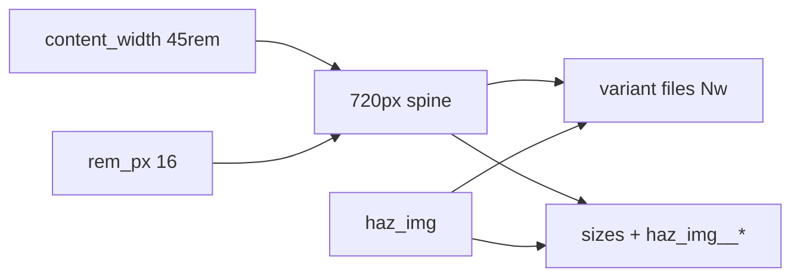

# haz_img v1 (#13) — review then build

**Unpause:** [#51](https://github.com/hugo-agent-zero/hugo-agent-zero/issues/51) is **closed**. Existing design in [.agents/plans/haz_img_shortcode_4d1f620b.plan.md](.agents/plans/haz_img_shortcode_4d1f620b.plan.md) stays the long form; this is the **execution slice**.

**Status:** author API **locked** (KISS). Ready to build when you switch to Agent / say execute. Demo export polish can follow shortcode green.

**Janitorial breaks:** when we step back from `#13`, pick small debt (e.g. eyes-on/close [#57](https://github.com/hugo-agent-zero/hugo-agent-zero/issues/57), mop [#55](https://github.com/hugo-agent-zero/hugo-agent-zero/issues/55)/[#56](https://github.com/hugo-agent-zero/hugo-agent-zero/issues/56)) — not a second feature track.

## Author API (mockup)

Paired shortcode (not graph `haz key=`). Author owns **all** markup in `.Inner` (img + any wrappers); HAZ only enriches `` tags (`srcset`, `sizes`, width class).

**Naming:** param is **`width`** — “how wide does this image need to be?” (not `window` / `layout`). Values are named keys into settings, not HTML px `width`.

**MD constraint:** bare HTML wrappers **outside** shortcodes are not reliable in content MD (would need another SC). So any wrapper markup lives **inside** `haz_img` `.Inner`. Unbalanced open/close across adjacent `haz_img` calls is intentional — each call is a string passthrough that only rewrites `` tags; the browser sees one tree after concatenation.

**No `wrapper_*` params** — author writes the HTML.

### Params

- `width` (required) — key into `settings.images.widths` → drives `sizes` + class `haz_img__{width}`
- **Not** shortcode params: `src`, `alt`, `loading`, `id`, `class`, `data-*`, wrappers (stay in `.Inner`)

### Widths (v1)

- `content` → `haz_img__content`
- `content_half` → `haz_img__content_half`
- `content_quarter` → `haz_img__content_quarter`

### Examples

Minimal (img only):

```md



```

Half / quarter:

```md







```

Self-wrapped (balanced in one call):

```md

<div id="solo" class="haz_img_group">

</div>

```

Gallery shell (split open/close across calls — all markup still inside SC inners):

```md

<div id="demo_gallery" class="haz_img_group">







</div>

```

Author `class` on the img is preserved and merged with the width class (e.g. `class="round haz_img__content"`).

Plain markdown `` stays dumb — no auto-srcset in v1.

## Locked model (refresh 2026-09-18)

- **Portis:** honest `sizes` (hole) + `srcset`/`w` (blocks). Browser × DPR. No separate retina mode.
- **Priority:** stop phones getting ~2000px masters; desktop slightly oversized is OK.
- **Two spines:** `ch` = type/sweet (#51). **Image ladder = rem measure → px** via `content_width` × `rem_px` (Atkinson / default root). Document “DevTools at rem ceiling” later (#54 / How To) — not blocking v1.
- **Spine numbers (v1):** `content_width: 45rem`, `rem_px: 16` → **720px**. Variants: xs 180, sm 360, md 540, lg 720, xl 1080, xxl 1440. Half@2× ≈ full@1× (same files).
- **Widths:** `content` / `content_half` / `content_quarter` → factors 1 / 0.5 / 0.25. Class `haz_img__{width}` derived (not author-synced).
- **Not v1:** `` auto-srcset, Hugo Resize, `<picture>`, gallery product, media library (#52).



## Architecture note (settings)

[`fn_get_sys_manifest.html`](c:/_au/work/hugo/dev/hugo-agent-zero-org/hugo-agent-zero-core/layouts/_partials/haz/helpers/fn/fn_get_sys_manifest.html) reads **child** [`settings.yaml`](c:/_au/work/hugo/dev/hugo-agent-zero-org/hugo-agent-zero-child/layouts/_partials/child/data/system_manifest/settings.yaml) only. So:

- **Child:** seed `settings.images` (kit default shape).
- **Core:** `layouts/shortcodes/haz_img.html` + `haz_img__*` rules in [`pico-x-agent-zero.css`](c:/_au/work/hugo/dev/hugo-agent-zero-org/hugo-agent-zero-core/assets/css/pico/pico-x-agent-zero.css).

## Implementation order

### 1. Settings (child)

Add under `settings:` in child `settings.yaml` (shape from archived plan):

- `images.config`: `variant_sep: "_"`, `class_prefix: "haz_img__"`, `content_width: "45rem"`, `rem_px: 16`, `measure_media: "(min-width: 45rem)"`
- `images.variants`: xs→xxl factors as above
- `images.widths`: content / content_half / content_quarter

Keep CSS `--haz_measure` ceiling aligned with `45rem`.

### 2. Shortcode (core)

New [`layouts/shortcodes/haz_img.html`](c:/_au/work/hugo/dev/hugo-agent-zero-org/hugo-agent-zero-core/layouts/shortcodes/haz_img.html) (sibling to [`haz.html`](c:/_au/work/hugo/dev/hugo-agent-zero-org/hugo-agent-zero-core/layouts/shortcodes/haz.html) — **not** graph `haz key=`).

**Author surface:** see **Author API (mockup)** above.

**Pipeline (from `src=`):**

1. Read each img’s `src` → split **dir** (optional) + **stem** + **ext** (e.g. `images/hero.jpg` → `images/` / `hero` / `.jpg`; flat `hero.jpg` → empty dir).
2. Use **`.Page.Resources`** (page-bundle files — not `assets/`).
3. For each key in `settings.images.variants`, `GetMatch` `{dir}{stem}_{key}{ext}` (sparse OK — only hits that exist).
4. Build **`srcset`** from matched resources (`RelPermalink` + derived `Nw` from variant config). **Zero matches:** still emit the img with `sizes` + width class (no `srcset`) — graceful sparse, not fail closed.
5. Build **`sizes`** from `width` + `settings.images.widths` / config (not from the files).
6. Inject `srcset` (if any) / `sizes` / width class before the img tag’s `>`; leave author `src` as-is.

Fail closed only if `width` missing/invalid or no usable `` / `src`. Never invent bare `100vw`.

**Inner enrich (how we find the tag):** same job as “basic img tag → inject before `>`” — only the search scope is `.Inner`, which **may** include other markup. Wrappers are ignored; we never hunt “the last `>` in `.Inner`.”

1. `findRE` on `.Inner` for img tags, e.g. `(?i)]*>` (v1: no literal `>` inside attribute values).
2. On that tag substring only: strip existing `srcset`/`sizes` if present; merge width `class`; **append** fresh `srcset` / `sizes` / class before the tag’s closing `>`.
3. `replace` the original tag string with the enriched one inside `.Inner`; leave surrounding markup untouched.

Split gallery inners still work: each call only rewrites its own img match(es).

**v1 scope:** enrich **every** `` in that call’s `.Inner` with the same `width`. Zero img matches → fail closed. No `wrapper_*` params — author HTML in `.Inner` only. No base-filename shortcode param — stem comes from `src=`. Subpaths in `src` supported.

Leave author `src` as-is. Sparse variants OK (only emit files that exist).

**`sizes` v1 formula (locked):**

- `content`: `(min-width: 45rem) 45rem, 95vw`
- `content_half`: `(min-width: 45rem) 22.5rem, 47.5vw`
- `content_quarter`: `(min-width: 45rem) 11.25rem, 23.75vw`

### 3. CSS (core pico-x)

```css
.haz_img__content { width: 100%; height: auto; }
.haz_img__content_half { width: 50%; height: auto; }
.haz_img__content_quarter { width: 25%; height: auto; }
```

(Mobile: full-row half/quarter can wrap later; v1 matches measure fractions.)

### 4. Proof (content, after shortcode green)

One page-bundle demo: `hero.jpg` + `hero_sm.jpg` / `hero_md.jpg` / `hero_lg.jpg` (at least) + one `haz_img width="content"` call on an existing demo post. Full content refresh stays [#49](https://github.com/hugo-agent-zero/hugo-agent-zero/issues/49).

### 5. Ship

Branches `feat/13-haz-img`. Core PR (shortcode + CSS) + child PR (settings; demo if ready). After core merge: **FF `v1.x.x`**. Pages dispatch for live proof. `Refs hugo-agent-zero/hugo-agent-zero#13`.

Plain [`render-image.html`](c:/_au/work/hugo/dev/hugo-agent-zero-org/hugo-agent-zero-core/layouts/_markup/render-image.html) stays dumb.

## First sitting goal

Get **settings + shortcode + CSS** compiling and enriching a local test img (even without pretty demo assets). Demo/export ladder files can be the “after a break” slice.
